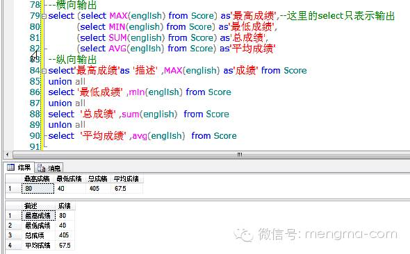

## 15 个常用的 SQL Server 高级语法


今天萌小妹给大家分享15个常用的SQL Server高级语法，会的同学温故知新，不会的同学就速速地学起来吧！~

  

## 1、case…end （具体的值）

  

case后面有值，相当于c#中的switch case

  

注意：case后必须有条件，并且when后面必须是值不能为条件。

```sql

-----------------case--end---语法结构---------------------

  

select name , --注意逗号

case level --case后跟条件

when 1 then '骨灰'

when 2 then '大虾'

when 3 then'菜鸟'

end as'头衔'

from [user]

```

## 2、case…end （范围）

  

case 后面无值，相当于c#中的if…else if…else….

  

注意：case后不根条件

```sql

------------------case---end--------------------------------

select studentId,

case

when english between 80 and 90 then '优'

when english between 60 and 79 then '良'

else '差'

end

from Score

------------------case---end--------------------------------

select studentId,

case

when english >=80 then '优'

when english >=60 then '良'

else '差'

end

from Score

-----------------------------------------------------

select *,

case

when english>=60 and math >=60 then '及格'

else '不及格'

end

from Score

```

## 3、if…eles

  

IF(条件表达式)

BEGIN --相当于C#里的{

语句1

……

END --相当于C#里的}

ELSE

BEGIN

语句1

……

END

--计算平均分数并输出，如果平均分数超过分输出成绩最高的三个学生的成绩，否则输出后三名的学生

```sql

declare @avg int --定义变量

select @avg= AVG(english) from Score --为变量赋值

select '平均成绩'+CONVERT(varchar,@avg) --打印变量的值

if @avg<60

begin

select '前三名'

select top 3 * from Score order by english desc

end

else

begin

select '后三名'

select top 3 * from Score order by english

end

```

## 4、while循环

  

WHILE(条件表达式)

BEGIN --相当于C#里的{

语句

……

BREAK

END --相当于C#里的}

  
```sql
--如果不及格的人超过半数(考试题出难了)，则给每个人增加分  

select * from Score

declare @conut int,@failcount int,@i int=0 --定义变量

select @conut =COUNT(*) from Score --统计总人数

select @failcount =COUNT(*) from Score where english<100 --统计未及格的人数

while (@failcount>@conut/2)

begin

update Score set english=english+1

select @failcount=COUNT(*) from Score where english<100

set @i=@i+1

end

select @i

update Score set english=100 where english >100

```

## 5、索引

  

使用索引能提高查询效率，但是索引也是占据空间的，而且添加、更新、删除数据的时候也需要同步更新索引，因此会降低Insert、Update、Delete的速度。只在经常检索的字段上(Where)创建索引。

  

1）聚集索引：索引目录中的和目录中对应的数据都是有顺序的。

2）非聚集索引：索引目录有顺序但存储的数据是没有顺序的。

```sql

--创建非聚集索引

CREATE NONCLUSTERED INDEX [IX_Student_sNo] ON student

(

[sNo] ASC

)

```

## 6、子查询

  

将一个查询语句做为一个结果集供其他SQL语句使用，就像使用普通的表一样，被当作结果集的查询语句被称为子查询。所有可以使用表的地方几乎都可以使用子查询来代替。

  

select * from (select * from student where sAge<30) as t --被查询的子表必须有别名

where t.sSex ='男' --对子表中的列筛选




转换为两位小数：CONVERT(numeric(10,2), AVG(english))

  

只有返回且仅返回一行、一列数据的子查询才能当成单值子查询。

```sql

select '平均成绩', (select AVG(english) from Score) --可以成功执行

select '姓名', (select sName from student) --错误，因为‘姓名’只有一行，而子表中姓名有多行


select * from student where sClassId in(select cid from Class where cName IN('高一一班','高二一班')) --子查询有多值时使用in

```

## 7、分页

```sql

--分页1

select top 3 * from student

where [sId] not in (select top (3*(4-1)) [sid] from student)--4表示页数

  

select *, row_number() over(order by [sage] desc ) from student-- row_number() over (order by..)获取行号

  

--分页2

select * from

(select *, row_number() over(order by [sid] desc ) as num from student)as t

where num between (Y-1)*T+1 and Y*T

order by [sid] desc

--分页3

select * from

(select ROW_NUMBER() over( order by [UnitPrice] asc) as num,* from [Books] where [publisherid]=1 )as t

where t.num between 1 and 20 --要查询的开始条数和结束条数

```

## 8、连接

```sql

select sName,sAge,

case

when english <60 then '不及格'

when english IS null then '缺考'

else CONVERT(nvarchar, english)

end as'英语成绩'

from student as s

left join Score as c on s.sid =c.sid

```

**内连接** inner join...on...

查询满足on后面条件的数据

**外连接**

**左连接**

left join...on...

先查出左表中的所有数据

再使用on后面的条件对数据过滤

**右连接**

right join...on...

先查出右表中的所有数据

再使用on后面的条件对数据过滤

**全连接**

full join ...on...

  

（*）交叉连接

cross join 没有on

第一个表的每一行和后面表的每一行进行连接

没有条件。是其它连接的基础

  

## 9、视图

  

优点：

  

筛选表中的行

防止未经许可的用户访问敏感数据

降低数据库的复杂程度

创建视图

  
```sql
create view v_Demo

as

select ......

```

## 10、局部变量

```sql

---------------------------------局部变量--------------------------

--声明变量:使用declare关键字，并且变量名已@开头，@直接连接变量名,中间没有空格。必须指明变量的类型，同时还可以声明多个不同类型的变量。

declare @name nvarchar(30) ,@age int

  

--变量赋值：

--1、使用set 给变量赋值,只能给一个变量赋值

set @age=18

set @name ='Tianjia'

  

select @age,@name --输出变量的值

  

--2、使用select 可以同时为多个变量赋值

select @age=19,@name='Laoniu'

  

--3、在查询语句中为变量赋值

declare @sum int =18 --为变量赋初值

select @sum= SUM(english) from Score --查询语句中赋值

select @sum --输出变量值

  

--4、变量作为条件使用

  

declare @sname nvarchar(10)='张三'

declare @sage int

select @sage=sage from student where sName=@sname

select @sage

  

--5、使用print输出变量值，一次只能输出一个变量的值,输出为文本形式

print @sage

```

## 11、全局变量

```sql

--------------------------全局变量（系统变量）-----------------

  

select * from student0

select @@error --最后一个T-SQL错误的错误号

select @@max_connections--获取创建的同时连接的最大数目

select @@identity --返回最近一次插入的编号

```

## 12、事务

  

事务：同生共死

  

指访问并可能更新数据库中各种数据项的一个程序执行单元(unit)–也就是由多个sql语句组成，必须作为一个整体执行

  

这些sql语句作为一个整体一起向系统提交，要么都执行、要么都不执行

  

语法步骤：

  

开始事务：BEGIN TRANSACTION

事务提交：COMMIT TRANSACTION

事务回滚：ROLLBACK TRANSACTION

判断某条语句执行是否出错：

  

全局变量@@ERROR；

  

@@ERROR只能判断当前一条T-SQL语句执行是否有错，为了判断事务中所有T-SQL语句是否有错，我们需要对错误进行累计；

```sql

---------------------------模拟转账----------------------------

declare @sumError int=0 --声明变量

  

begin tran

update bank set balance=balance-1000 where cId='0001'

set @sumError=@sumError+@@error

update bank set balance=balance+1000 where cId='0002'

set @sumError=@sumError+@@error

  

if (@sumError=0)

commit tran --提交成功,提交事务

else

rollback tran --提交失败,回滚事务

```

## 13、存储过程

  

存储过程—就像数据库中运行方法(函数)

  

和C#里的方法一样，由存储过程名/存储过程参数组成/可以有返回结果。

  

前面学的if else/while/变量/insert/select 等，都可以在存储过程中使用

  

优点：

  

执行速度更快 – 在数据库中保存的存储过程语句都是编译过的

允许模块化程序设计 – 类似方法的复用

提高系统安全性 – 防止SQL注入

减少网络流通量 – 只要传输 存储过程的名称

系统存储过程

由系统定义，存放在master数据库中

名称以“sp_”开头或”xp_”开头

  

创建存储过程：

  

定义存储过程的语法

CREATE PROC[EDURE] 存储过程名

@参数1 数据类型 = 默认值 OUTPUT,

@参数n 数据类型 = 默认值 OUTPUT

AS

SQL语句

参数说明：

参数可选

参数分为输入参数、输出参数

输入参数允许有默认值

EXEC 过程名 [参数]

```sql

----------------------例--------------------------

if exists (select * from sys.objects where name='usp_GroupMainlist1')

drop proc usp_GroupMainlist1

go

create proc usp_GroupMainlist1

@pageIndex int, --页数

@pageSize int, --条数

@pageCount int output--输出共多少页

as

declare @count int --共多少条数据

select @count =count(*) from [mainlist] --获取此表的总条数

set @pageCount=ceiling(@count*1.0/@pageSize)

  

select * from

(select *,row_number() over(order by [date of booking] desc) as 'num' from [mainlist]) as t

where num between(@pageSize*(@pageIndex-1)+1) and @pageSize*@pageIndex

order by [date of booking] desc

-------------------------------------------------------------------------------------------

--调用

declare @page int

exec usp_GroupMainlist1 1,100,@page output

select @page

```

## 14、常用函数

  

1）ISNULL(expression,value) 如果expression不为null返回expression表达式的值，否则返回value的值

  

2）聚合函数

  

avg() -- 平均值 统计时注意null不会被统计，需要加上isnull(列名，0)

sum() -- 求和

count() -- 求行数

min() -- 求最小值

max() -- 求最大值

3）字符串操作函数

  

LEN() --计算字符串长度

LOWER() --转小写

UPPER () --大写

LTRIM() --字符串左侧的空格去掉

RTRIM () --字符串右侧的空格去掉

LTRIM(RTRIM(' bb '))

LEFT()、RIGHT() -- 截取取字符串

SUBSTRING(string,start_position,length)

-- 参数string为主字符串，start_position为子字符串在主字符串中的起始位置（从1开始），length为子字符串的最大长度。

  

SELECT SUBSTRING('abcdef111',2,3)

REPLACE(string,oldstr,newstr)

  

Convert(decimal(18,2),num)--保留两位小数

4）日期相关函数

  

GETDATE() --取得当前日期时间

DATEADD (datepart , number, date )--计算增加以后的日期。参数date为待计算的日期；参数number为增量；参数datepart为计量单位，可选值见备注。DATEADD(DAY, 3,date)为计算日期date的3天后的日期，而DATEADD(MONTH ,-8,date)为计算日期date的8个月之前的日期

DATEDIFF ( datepart , startdate , enddate ) --计算两个日期之间的差额。 datepart 为计量单位，可取值参考DateAdd。

  

-- 获取日期的某一部分 ：

DATEPART (datepart,date)--返回一个日期的特定部分 整数

DATENAME(datepart,date)--返回日期中指定部分 字符串

YEAR()

MONTH()

DAY()

  

## 15、sql语句执行顺序

  

5>…Select 5-1>选择列,5-2>distinct,5-3>top

1>…From 表

2>…Where 条件

3>…Group by 列

4>…Having 筛选条件

6>…Order by 列

  
