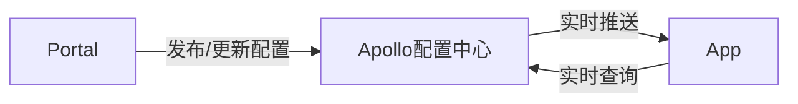
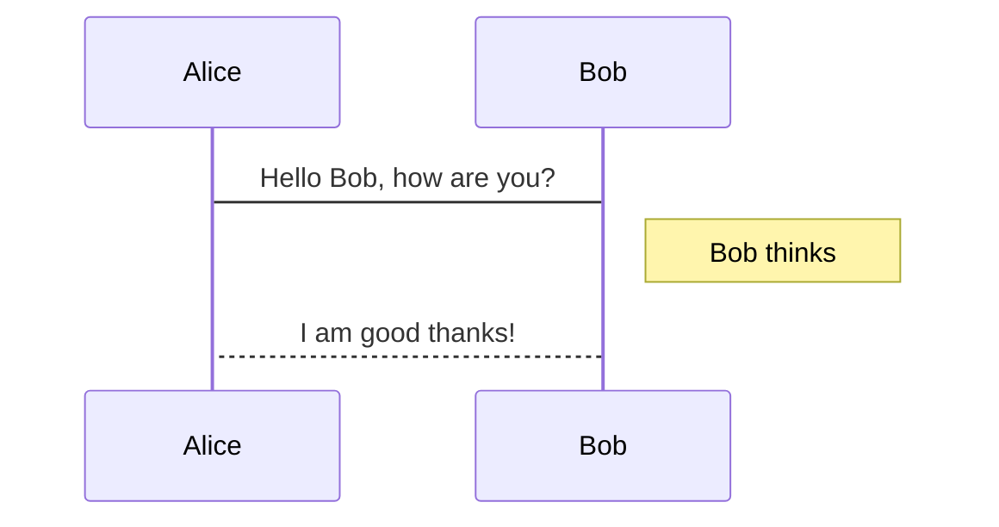
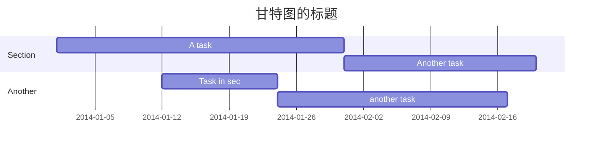

# 基础流程图
开头以 `graph` 声明，流程图的语法如下：


# 流程图

```flow
st=>start: Start
op=>operation: Your Operation
cond=>condition: Yes or No?
e=>end

st->op->cond
cond(yes)->e
cond(no)->op
```

# 时序图

时序图以 `sequenceDiagram` 开头声明，语法如下所示 



#  甘特图
以 `gantt` 开头，用 `section`划分任务集，语法如下：

