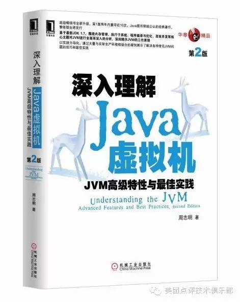

2016年Java正好20周岁。就流行度而言，它是当今编程语言毫无争议的王者。各编程语言排行榜，无论TIOBE还是IEEE Spectrum，Java都以较大优势领先其他语言。应用方面，Java语言和JVM平台在互联网后端、企业级开发、移动开发（Android）和大数据（Hadoop、Spark）等领域的地位也很难撼动。在美团•大众点评技术团队，Java也是使用者最多的语言。

这一份Java推荐书单，结合了美团•大众点评Java技术俱乐部的几百位一线工程师的建议，并请美团点评技术学院院长、出版界的大牛刘江老师进行了把关和筛选，快根据你的需要，去挑选适合你的那一本吧！

## **入门 · 练级**

### **《Head First Java》**

非传统的教学方式，运用大量图片和对话，尽量有趣地讲解严肃的技术主题。适合初学者的入门书籍。当然，也有同学反映信息密度不高，学习效率一般。

### **《Java 核心技术：卷1 基础知识》**

口碑最好的Java教程。系统全面讲解Java语言的核心概念、语法、重要特性和开发方法，内有大量程序实例，极具实用价值。 是Java初学者和Java程序员的必备参考书。

## **进阶 · 打怪**

### **《Effective Java》**

Joshua Bloch大神（Java Collections作者，曾是Sun公司杰出工程师和Google首席Java架构师）的代表作。介绍了在Java编程中78条极具实用价值的经验规则，揭示了应该做什么，不应该做什么才能产生清晰、健壮和高效的代码，并通过例子代码加以进一步说明，这些经验规则涵盖了大多数开发人员每天所面临的问题的解决方案。

### **《Java并发编程实战》**

Brian Goetz等Java核心团队的集体智慧结晶。本书深入浅出地介绍了Java线程和并发，是一本完美的Java并发参考手册，其中并非只讲述了Java的多线程设施，对一般的并发编程的原理也有相当透彻的阐述。

### **《Java编程思想》**

曾被誉为“Java圣经”，但颇受争议。有些人说每读一遍都有新收获，有人说应作为辅助教材。如果你想阅读它，请循序渐进地看，不要操之过急。

### **《编写高质量代码——改善Java程序的151个建议》**

国人原创作品。内容全部由Java编码的最佳实践组成，为Java程序员如何编写高质量的Java代码提出了151条极为宝贵的建议。对于每一个问题，不仅以建议的方式从正反两面给出了被实践证明为十分优秀的解决方案和非常糟糕的解决方案，而且还分析了问题产生的根源，犹如醍醐灌顶，让人豁然开朗。

### **《Spring技术内幕（第2版）》**

国人原创作品。从源代码的角度对Spring的内核和各个主要功能模块的架构、设计和实现原理进行了深入剖析。你不仅能从本书中参透Spring框架的优秀架构和设计思想，还能从Spring优雅的实现源码中一窥Java语言的精髓。

### **《深入分析Java Web技术内幕》**

作者是2009年加入淘宝的许令波。全面、深入地阐述了Web前端、Java和Java 服务端技术。

### **《大型网站系统与Java中间件实践》**

作者是蘑菇街技术副总曾宪杰，曾长期负责淘宝主站。通过这本书可以了解大型网站架构变迁过程中的较为通用的问题和解法，并了解构建支撑大型网站的 Java 中间件的实践经验。

## ***深修 · 要上天***

### **《深入理解Java虚拟机》**

非常难得的国人原创JVM实践性图书。“其中穿插的经验、技巧、案例、实战处处都可见作者的实践之中积累的功力。”此书与Bill Venners的老书《深入Java虚拟机》很大程度上是互补的，可以参看。

### **《Java性能权威指南》**

Java性能方面的新书，可能也是最好的一本。不仅讲述了对什么进行优化，如何优化，还阐述了大量然后编写高效代码的最佳实践。虽然篇幅小一些，但比Oracle官方的那本内容博杂的《Java性能优化权威指南》其实更深入。

------

### 『推荐Java程序员阅读的其他通用技术图书』　 

- 《重构改善既有代码的设计》
- 《Clean Code》
- 《大型网站技术架构》
- 《企业应用架构模式》

还有你认为不错的书籍我没推荐？来留言大声喊出来！